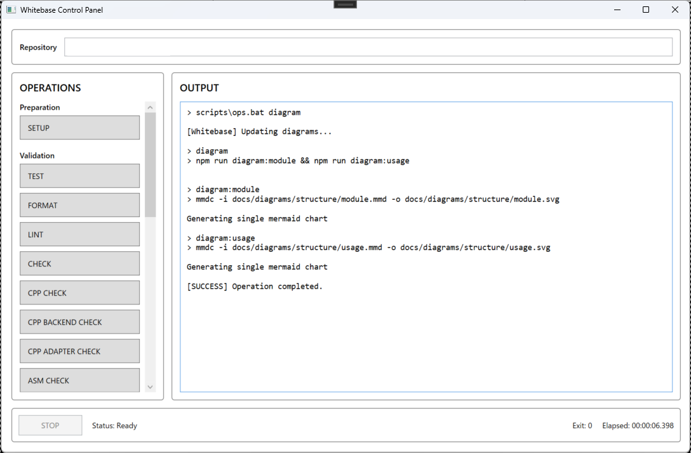

# Whitebase

学習・実験用リポジトリです。
APIや構成は頻繁に変わる予定です。

## 目的

仕組みを、小さい単位で実装し、観察・記録・比較・可視化することです。
例えば

- ScalarとSIM
- Rust/C++/Assembly
- C ABIとFFI
- Debug / Releaseビルド
- TauriのIPC
- Http + JSON
- WebAssembly
- デスクトップUIとブラウザUI

## 予定

1. Tauri Visualizationへの接続
2. Python Tools置き場の作成
3. `0.1+0.2`追加をして、機能追加フローを作成

やれればどっかにデモ。


## アーキテクチャ
TauriではIPC、通常のブラウザではHTTP APIを通して、  
同じRunnerとCoreを利用します。



## 構成図

### モジュール構成図

矢印は、モジュール間の依存・利用関係または計算結果の受け渡し方向を示します。  
破線のモジュールは、将来的な追加を予定しています。



### 利用構成図

ライブラリの利用方法の想定です。  
`whitebase-core`を計算処理の中心とし、利用する環境に応じた境界を通して呼び出します。  





## セットアップ

- [セットアップ履歴](docs/setup.md)


## 開発手順

### 開発用コマンド

Windows環境では、開発・テスト・ビルド用の操作を
`scripts/ops.bat`から実行できます。

リポジトリのルートディレクトリで、以下の形式で実行します。

```powershell
.\scripts\ops.bat <command>
```

| コマンド | 説明 | Description |
| --- | --- | --- |
| `setup` | npm依存関係、WebAssemblyコンパイルターゲット、wasm-packをセットアップします。 | Set up npm dependencies, the WebAssembly compilation target, and wasm-pack. |
| `test` | Rustワークスペース全体のテストを実行します。 | Run Rust workspace tests. |
| `fmt` | Rustソースコードをフォーマットします。 | Format Rust source code. |
| `lint` | Clippyによる静的解析を実行します。 | Run static analysis with Clippy. |
| `check` | フォーマット確認、静的解析、テスト、Wasm、フロントエンド、Rust C ABI、C++バックエンド、RustからC++へのAdapter、Assembly経路を総合検査します。 | Run formatting, linting, tests, WebAssembly, frontend, Rust C ABI, C++ backend, Rust-to-C++ adapter, and Assembly integration checks. |
| `wasm-check` | WebAssemblyクレートのコンパイルを確認します。 | Check that the WebAssembly crate compiles. |
| `cpp-check` | C++からRust C ABIを呼び出せることを確認します。 | Check the C++ to Rust C ABI connection. |
| `cpp-backend-check` | C++計算バックエンドのScalarおよびAVX配列演算を確認します。 | Check the scalar and AVX array operations of the C++ computation backend. |
| `cpp-adapter-check` | RustからC++計算バックエンドを呼び出せることを確認します。 | Check the Rust to C++ computation backend adapter. |
| `asm-check` | C++からAssembly関数を呼び出せることを確認します。 | Check the C++ to Assembly connection. |
| `tree` | リポジトリツリーを表示し、ドキュメントを更新します。 | Display the repository tree and update its documentation. |
| `diagram` | Mermaidの構成図をSVGへ変換して更新します。 | Generate and update SVG diagrams from Mermaid sources. |
| `dev` | Tauriアプリケーションを開発モードで起動します。 | Start the Tauri application in development mode. |
| `web-dev` | WebAssemblyを開発用にビルドし、Web開発サーバーを起動します。 | Build WebAssembly for development and start the Web development server. |
| `wasm-build` | WebAssemblyのブラウザ用成果物を生成します。 | Build browser-compatible WebAssembly artifacts. |
| `c-api-build` | Rust C APIのDLLとインポートライブラリをビルドします。 | Build the Rust C API DLL and import library. |
| `cpp-build` | C++スモークテストクライアントをビルドします。 | Build the C++ smoke test client. |
| `cpp-backend-build` | C++計算バックエンドの静的ライブラリをビルドします。 | Build the C++ computation backend static library. |
| `asm-build` | Assemblyライブラリとスモークテストクライアントをビルドします。 | Build the Assembly library and smoke test client. |
| `web-build` | フロントエンドをビルドします。 | Build the frontend. |
| `tauri-build` | Tauriデスクトップアプリケーションをビルドします。 | Build the Tauri desktop application. |
| `clean` | 生成されたビルド成果物を削除します。 | Remove generated build artifacts. |

### Whitebase Control Panel



`Whitebase Control Panel`は、開発・検証・ドキュメント更新用のコマンドをGUIから実行するための、Windows専用WPFアプリケーションです。

内部では`scripts/ops.bat`を呼び出しているため、コマンドラインと同じ処理を実行できます。  
標準出力、終了コード、処理時間は画面上で確認できます。

主な操作は、用途ごとに分類されています。

| 分類 | 操作 |
| --- | --- |
| Validation | テスト、フォーマット、静的解析、Wasmチェック、C++チェック、C++ Backendチェック、C++ Adapterチェック、Assemblyチェック、総合チェック |
| Documentation | リポジトリツリー、Mermaidダイアグラムの更新 |
| Development | Tauri開発環境、Web開発環境の起動 |
| Build | Wasm、Rust C API、C++クライアント、C++計算バックエンド、Assembly、Web UI、Tauriアプリケーションのビルド |
| Maintenance | ビルド成果物の削除 |

起動には、プロジェクトのターゲットバージョンに対応する.NET SDKが必要です。

```powershell
.\tools\control-panel.bat
```

### Win32 API
`Whitebase`の計算処理や`WebAssembly`向けコードは、Windows固有APIへ依存しない構成を基本としています。

一方、リポジトリ操作用の`Whitebase Control Panel`は`WPF`で構築されたWindows専用ツールです。開発プロセスの停止やウィンドウの終了要求など、Windowsとの連携が必要な処理では`Win32 API`を使用します。

Win32固有の実装は専用クラスライブラリへ分離し、計算コア、WebAssembly、Tauriアプリケーションの共有ロジックへ混在させない方針です。Control Panelは開発作業を補助するための任意ツールであり、Whitebaseの計算機能そのものに必要な依存関係ではありません。

## 実装済みのベンチマークについて
```text
入力生成→参照BackEndをウォームアップ→複数回実行して時間計測→最小・最大。平均・合計時間の集計→参照結果との誤差を比較→Tauri・ブラウザへレポートを返す
```

※ベンチマーク結果はビルド構成、CPU、キャッシュ、メモリ帯域、OSのスケジューリングなどに影響されます。性能比較ではDebugではなくRelease構成を推奨します。


### HTTP API

ローカルHTTP　APIはRust+Axumで実装しています。

```powershell
GET  /api/health
POST /api/benchmarks/add-f32
```

ヘルスチェック
```powershell
Invoke-RestMethod `
  -Uri "http://127.0.0.1:1430/api/health"
```

ベンチマーク実行
```powershell
$body = @{
  inputLength = 1000000
  warmupIterations = 10
  measuredIterations = 100
} | ConvertTo-Json

Invoke-RestMethod `
  -Method Post `
  -Uri "http://127.0.0.1:1430/api/benchmarks/add-f32" `
  -ContentType "application/json" `
  -Body $body

```


