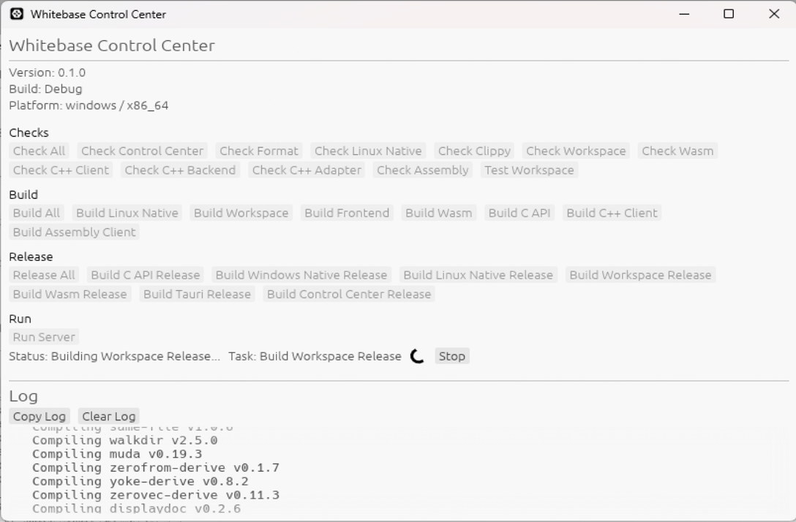

### Whitebase Control Panel



`Whitebase Control Panel`は、開発・検証・ドキュメント更新用のコマンドをGUIから実行するための、Windows専用WPFアプリケーションです。

内部では`scripts/ops.bat`を呼び出しているため、コマンドラインと同じ処理を実行できます。  
標準出力、終了コード、処理時間は画面上で確認できます。

`scripts/ops.bat`のコマンドについては以下を参考にしてください。
- [Whitebase Operations](../tools/Whitebase%20Operations.md)

主な操作は、用途ごとに分類されています。

| 分類 | 操作 |
| --- | --- |
| Validation | テスト、フォーマット、静的解析、Wasmチェック、C++チェック、C++ Backendチェック、C++ Adapterチェック、Assemblyチェック、総合チェック |
| Documentation | リポジトリツリー、Mermaidダイアグラムの更新 |
| Development | Tauri開発環境、Web開発環境の起動 |
| Build | Wasm、Rust C API、C++クライアント、C++計算バックエンド、Assembly、Web UI、Tauriアプリケーションのビルド |
| Maintenance | ビルド成果物の削除 |

起動には、プロジェクトのターゲットバージョンに対応する.NET SDKが必要です。

```powershell
.\tools\control-panel.bat
```

### Win32 API
`Whitebase`の計算処理や`WebAssembly`向けコードは、Windows固有APIへ依存しない構成を基本としています。

一方、リポジトリ操作用の`Whitebase Control Panel`は`WPF`で構築されたWindows専用ツールです。開発プロセスの停止やウィンドウの終了要求など、Windowsとの連携が必要な処理では`Win32 API`を使用します。

Win32固有の実装は専用クラスライブラリへ分離し、計算コア、WebAssembly、Tauriアプリケーションの共有ロジックへ混在させない方針です。Control Panelは開発作業を補助するための任意ツールであり、Whitebaseの計算機能そのものに必要な依存関係ではありません。